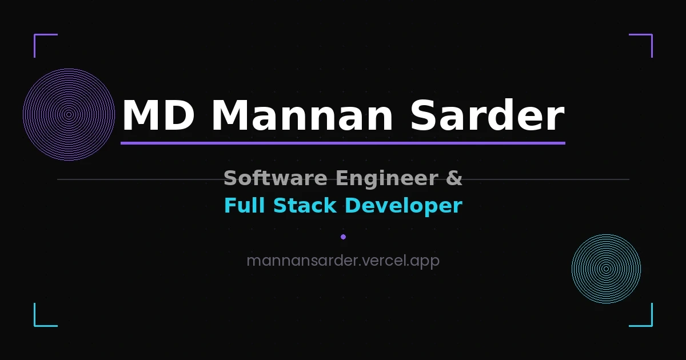

# MD Mannan Sarder — Portfolio

Personal portfolio website of **MD Mannan Sarder**, Software Engineer & Full Stack Developer based in Bangladesh.

**Live:** [mannansarder.vercel.app](https://mannansarder.vercel.app)



## About

I build modern web applications and enjoy turning ideas into useful digital products — currently focused on full-stack development, with a growing interest in UI/UX design and continuous learning.


## Tech Stack

- **Frontend:** Next.js 15 (App Router), React 19, TypeScript, Tailwind CSS
- **3D & Motion:** Three.js, React Three Fiber, Framer Motion
- **Deployment:** Vercel

## Featured Projects

### [RetailSync Hub](https://github.com/mannan-sarder/retailsync-hub)
A production-grade, 4-role retail & e-commerce platform (Admin, Employee, Delivery, Customer) with real-time rider tracking via Server-Sent Events, an in-store POS terminal, and a dynamic analytics dashboard. Migrated from a legacy PHP/MySQL system to Next.js 15 + PostgreSQL.

`Next.js 15` `PostgreSQL` `Prisma` `NextAuth v5` `Server-Sent Events` `Leaflet`

### [MediMind](https://github.com/mannan-sarder/medimind)
A fully offline Android app that scans medical test reports via OCR, compares results against WHO/NIH standard ranges, and shows bilingual (Bangla/English) analysis with report history and medicine reminders.

`Java` `Android SDK` `Google ML Kit` `Room Database` `MPAndroidChart`

## Getting Started

Install dependencies and start the dev server:

```bash
npm install
npm run dev
```

Open [http://localhost:3000](http://localhost:3000) to view it locally.

## Scripts

| Command | Description |
|---|---|
| `npm run dev` | Start dev server (Turbopack) |
| `npm run build` | Production build |
| `npm run start` | Start production server |
| `npm run lint` | Run ESLint |
| `npm run type-check` | TypeScript check, no emit |

## Deployment

Deploy easily on [Vercel](https://vercel.com) — connect the GitHub repo and every push to `main` triggers a new production deployment.

## Connect

- GitHub — [@mannan-sarder](https://github.com/mannan-sarder)
- LinkedIn — [mannansarder](https://linkedin.com/in/mannansarder)
- Email — [mannansarder00@gmail.com](mailto:mannansarder00@gmail.com)
